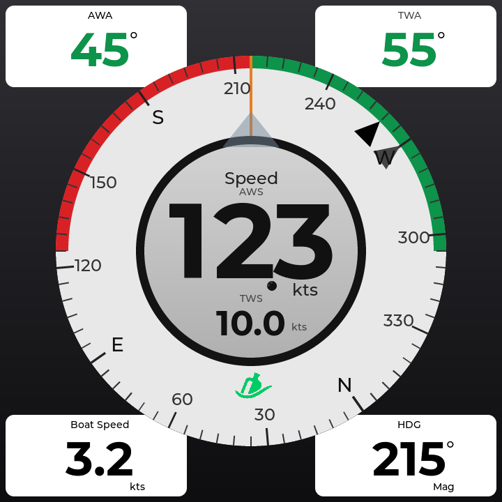
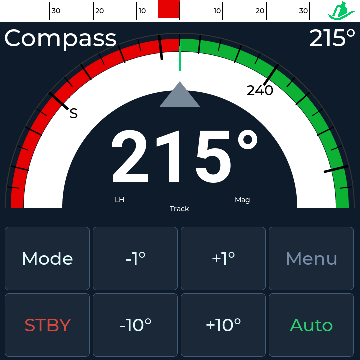
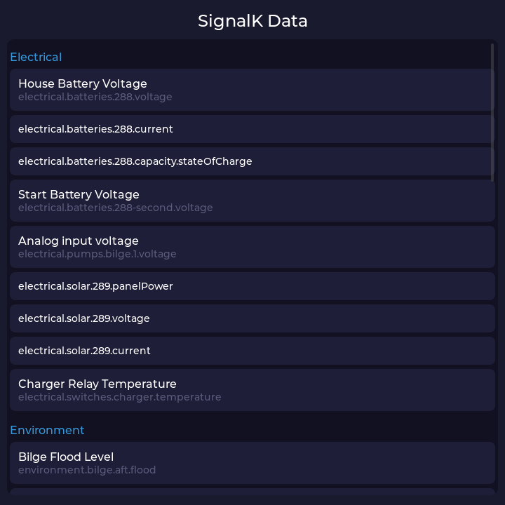
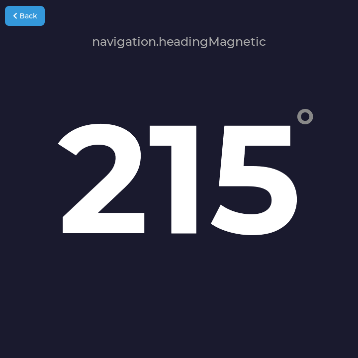
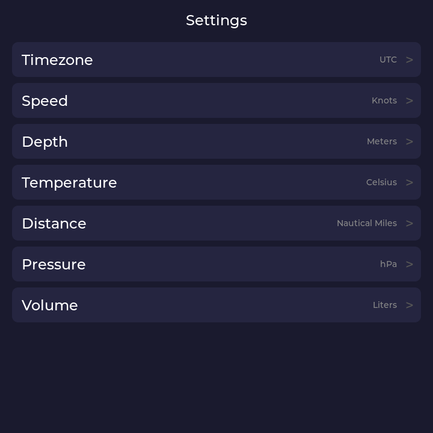
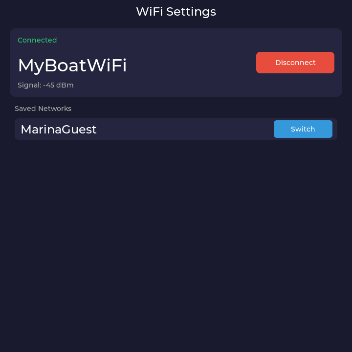
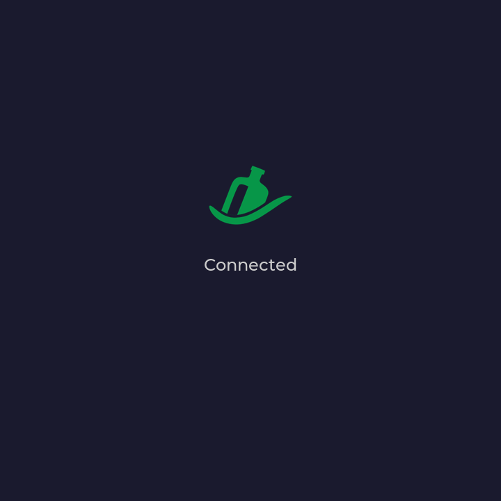

# SignalK Instrument Panel for Waveshare ESP32-P4

A touchscreen [SignalK](https://signalk.org/) marine instrument display built on the
[Waveshare ESP32-P4-WIFI6-Touch-LCD-4B](https://www.waveshare.com/esp32-p4-wifi6-touch-lcd-4b.htm)
("Smart 86 Box").

## Hardware

| | |
|---|---|
| **Board** | [Waveshare ESP32-P4-WIFI6-Touch-LCD-4B](https://www.waveshare.com/esp32-p4-wifi6-touch-lcd-4b.htm) |
| **Display** | 4" IPS 720x720 MIPI-DSI, ST7703 driver |
| **Touch** | GT911 capacitive (I2C) |
| **WiFi** | ESP32-C6 coprocessor via SDIO ([esp-hosted](https://github.com/espressif/esp-hosted)) |
| **Flash / PSRAM** | 16 MB / 8 MB |

## Screenshots

Screenshots are rendered by the headless [LVGL](https://lvgl.io/) simulator at the display's native 720x720 resolution.

| Wind Rose | Autopilot | Data Browser | Detail View |
|:---------:|:---------:|:------------:|:-----------:|
|  |  |  |  |

| Settings | WiFi Settings | Launcher |
|:--------:|:-------------:|:--------:|
|  |  |  |

## Apps

| App | Description |
|-----|-------------|
| **Data Browser** | Discovers all SignalK paths from the server via HTTP. Tap any numeric path for a full-screen live value display with dynamic font sizing. |
| **Wind Rose** | Heading-relative compass rose with rotating tick ring, cardinal labels, apparent/true wind speed, and corner data panels (AWA, TWA, depth, heading). |
| **Autopilot** | Autopilot controller with scrolling compass, wind bar, and engage/disengage/mode/adjust controls via the SignalK Autopilot API. |
| **Settings** | Timezone and unit preferences (speed, depth, temperature, distance, pressure, volume). Persisted in NVS. |
| **WiFi Settings** | On-device WiFi configuration with network scanning, autocomplete, and saved network management. |

## Features

- **Zero configuration networking** — finds SignalK servers automatically via mDNS
- **On-device WiFi setup** — no compile-time credentials needed
- **Live data** — WebSocket subscription with observer pattern for efficient UI updates
- **Unit conversion** — user-selectable display units (knots/m/s, feet/meters, etc.)
- **Device authentication** — SignalK access request pairing with NVS token persistence
- **Audio feedback** — click, engage/disengage sweeps, and invalid-press buzz via ES8311 codec
- **True wind derivation** — computes TWS/TWA from AWS + AWA + STW when server doesn't provide it
- **Headless simulator** — validate UI changes on desktop without hardware

## Prerequisites

- [ESP-IDF v5.4](https://docs.espressif.com/projects/esp-idf/en/v5.4/esp32p4/get-started/index.html)
- Python 3.10+ (macOS: use Homebrew, not the Xcode system Python)
- CMake (`brew install cmake` on macOS)

```sh
# Install ESP-IDF
git clone --recursive https://github.com/espressif/esp-idf.git ~/esp/esp-idf
cd ~/esp/esp-idf && git checkout v5.4 && ./install.sh esp32p4

# Add shell alias
echo 'alias get_idf=". $HOME/esp/esp-idf/export.sh"' >> ~/.zshrc
```

See [docs/SETUP.md](docs/SETUP.md) for detailed setup instructions and [docs/BUILD.md](docs/BUILD.md) for build system reference.

## Build and Flash

```sh
get_idf            # activate ESP-IDF environment
idf.py build       # compile (~2 MB binary)
idf.py -p /dev/cu.usbmodem* flash   # flash via USB-C (Linux: /dev/ttyUSB0)
```

Or use the Makefile:

```sh
make build
make flash PORT=/dev/cu.usbmodem*
```

Dependencies are declared in [`main/idf_component.yml`](main/idf_component.yml) and downloaded automatically on first build.

## First Boot

1. The launcher shows an amber SignalK logo — WiFi is not configured yet
2. Open the **WiFi Settings** app, select your network, enter the password
3. Credentials are saved to NVS and used automatically on subsequent boots
4. The device discovers the SignalK server via mDNS and connects
5. The launcher logo turns green — data is flowing

The ESP32-C6 WiFi coprocessor supports **2.4 GHz only**. The device and SignalK server must be on the same network.

## Simulator

The simulator compiles the actual firmware UI code as a native desktop binary using LVGL 8.x. No hardware needed.

```sh
# First time — downloads LVGL (~30s)
cmake -B simulator/build -S simulator -DCMAKE_BUILD_TYPE=Release -Wno-dev

# Render all apps
simulator/render.sh

# Render a specific app
simulator/render.sh windrose
simulator/render.sh autopilot
simulator/render.sh wifi
simulator/render.sh settings
simulator/render.sh browser
```

Output: `simulator/screenshots/*.png` at 720x720.

See [docs/SIMULATOR.md](docs/SIMULATOR.md) for architecture details.

## Dev Server

For development, run a local [SignalK server](https://github.com/SignalK/signalk-server) with sample data:

```sh
cd ../signalk-server
node bin/signalk-server --sample-nmea0183-data --sample-n2k-data --override-timestamps
```

The device discovers it automatically via mDNS. See [docs/DEV_SERVER.md](docs/DEV_SERVER.md) for the full workflow.

## Project Structure

```
main/                        Entry point, BSP init, WiFi, mDNS, launcher overlay
components/
  signalk_client/            WebSocket client, InstrumentStore, observer pattern
  data_browser_app/          Dynamic SignalK path browser with live detail view
  wind_rose_app/             Heading compass rose with wind + corner panels
  autopilot_app/             Autopilot controller with SignalK API control
  settings_app/              Timezone and unit preference picker
  wifi_settings_app/         On-device WiFi configuration UI
  signalk_auth/              Device authentication and API calls
  wifi_manager/              WiFi scan, connect, NVS credential persistence
  unit_config/               Unit conversion engine and NVS preferences
  audio_feedback/            Button sounds via ES8311 codec
simulator/                   Headless LVGL renderer for desktop UI validation
docs/                        Setup, build, simulator, autopilot, and API reference
```

## Documentation

| Document | Description |
|----------|-------------|
| [docs/SETUP.md](docs/SETUP.md) | Prerequisites, build/flash workflow, first boot |
| [docs/BUILD.md](docs/BUILD.md) | Component dependencies, sdkconfig, IDF 5.4 build issues |
| [docs/DEV_SERVER.md](docs/DEV_SERVER.md) | Local SignalK server setup and connection |
| [docs/SIMULATOR.md](docs/SIMULATOR.md) | Headless LVGL simulator architecture |
| [docs/AUTOPILOT_UI.md](docs/AUTOPILOT_UI.md) | Autopilot display design and API integration |
| [docs/FONTS.md](docs/FONTS.md) | Custom LVGL font generation with lv_font_conv |
| [docs/signalk-paths.md](docs/signalk-paths.md) | Example SignalK paths and unit conversions |

## Built With

- [ESP-IDF v5.4](https://github.com/espressif/esp-idf) — Espressif IoT Development Framework
- [LVGL 8.4](https://lvgl.io/) — Light and Versatile Graphics Library
- [esp-ui (esp-brookesia) v0.2](https://github.com/espressif/esp-ui) — Phone-style launcher shell
- [SignalK](https://signalk.org/) — Open marine data standard
- [Waveshare BSP](https://github.com/waveshareteam/Waveshare-ESP32-components) — Board support package

## License

MIT
